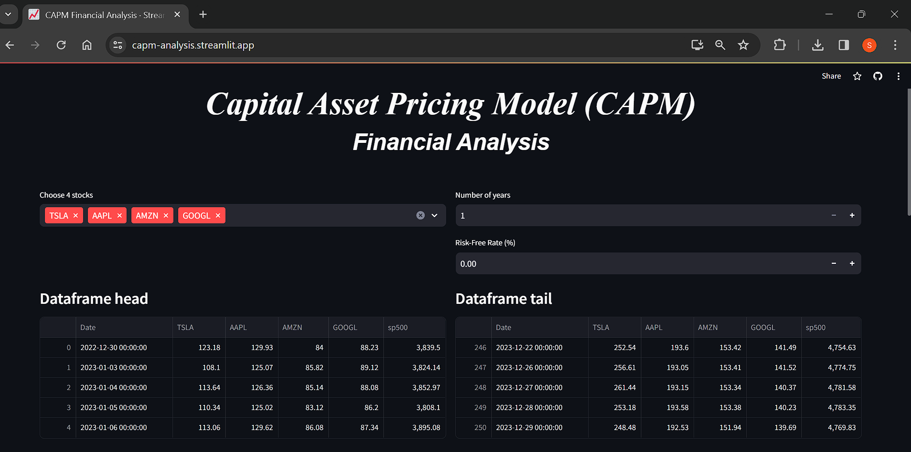
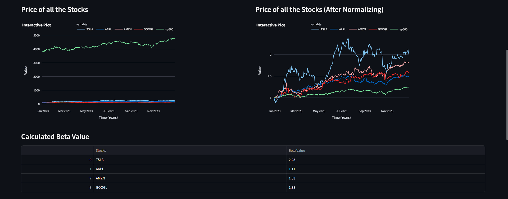
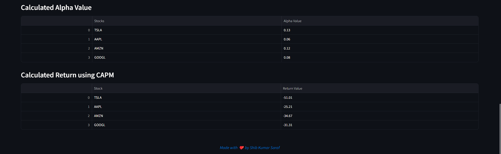

# Capital Asset Pricing Model (CAPM) Financial Analysis

## Introduction

The Capital Asset Pricing Model (CAPM) Financial Analysis project is designed to provide users with a comprehensive tool for evaluating the financial performance of selected stocks. The CAPM model, a cornerstone in modern portfolio theory, is employed to calculate key metrics such as Beta and Alpha. These metrics aid in understanding the systematic risk, expected returns, and potential for outperformance of individual stocks.

## Objective

The primary objective of this project is to empower users with insights into the risk and return characteristics of their chosen stocks, facilitating informed investment decisions. By leveraging the CAPM model, the application goes beyond mere historical price analysis, offering a forward-looking perspective based on fundamental principles of asset pricing.


## Tech Stack

- **Programming Language:** Python
- **Web Framework:** streamlit (for the user interface)
- **Dataset:** yfinance
- **Data Analysis Libraries:** Pandas, NumPy
- **Visualization Libraries:** Matplotlib, Plotly
- **Math and Statistics:** SciPy
- **Version Control:** Git

## Project Components

1. **app.py**
   - This central file orchestrates the entire application. It establishes the user interface, collects input, initiates data download, and coordinates the calculation and display of financial metrics.

2. **content_renderer.py**
   - This module encapsulates functions responsible for rendering content within the application. It includes functions for obtaining user input, downloading financial data, and displaying dataframes and plots.

3. **functions.py**
   - The utility functions within this file play a crucial role in the project. They facilitate interactive chart plotting, data normalization, calculation of daily returns, and determination of Beta and Alpha values.

## Mathematical Foundation

### CAPM Formula

The CAPM model is based on the following formula:

$$
R_i = R_f + \beta_i \cdot (R_m - R_f) + \alpha_i
$$

$$
\begin{align*}
& \text{Where:} \\
& R_i : \text{Expected return of the asset.} \\
& R_f : \text{Risk-free rate.} \\
& R_m : \text{Expected return of the market.} \\
& \beta_i : \text{Beta of the asset, representing its sensitivity to market movements.} \\
& \alpha_i : \text{Alpha of the asset, indicating its expected excess return.}
\end{align*}
$$


### Beta Calculation

Beta is calculated using the covariance and variance of the asset's returns in relation to the market returns:

$$ \beta_i = \frac{{\text{{cov}}(R_i, R_m)}}{{\text{{var}}(R_m)}} $$

### Alpha Calculation

Alpha represents the asset's expected excess return after adjusting for market risk. It is derived from the intercept of the asset's regression line:

$$ \alpha_i = R_i - [R_f + \beta_i \cdot (R_m - R_f)] $$

## Screenshots

<table align="center">
       <caption style="text-align: center; font-weight: bold;">Home Page</caption>

  <tr>
    <td></td>
  </tr>
  <tr>
    <td></td>
  </tr>
  <tr>
    <td></td>
  </tr>
</table>


## Getting Started

Before you can run this app, ensure that you have the necessary prerequisites installed on your machine.

### Prerequisites

Make sure you have the following installed:

- [Python 3.x](https://www.python.org/downloads/): The programming language used to run the app.
- [yfinance library](https://pypi.org/project/yfinance/): A Python wrapper for downloading financial data from Yahoo Finance.
- [Streamlit](https://streamlit.io/): A Python library for creating web applications.


### Installation

Follow these steps to set up this app on your local machine: 

1. **Clone the Repository:**

   Open your terminal and run the following commands:

   ```bash
   git clone https://github.com/shib1111111/CAPM-Financial-Analysis.git
   cd CAPM-Financial-Analysis

   ```

2. **Install Dependencies:**

Run the following command to install the required dependencies:

```bash
pip install -r requirements.txt
  ```

## Usage
To run this app, execute the following command in your terminal:
```bash
streamlit run app.py  
```
Visit the provided local URL (usually http://localhost:8501) in your web browser to access the app.Upon running the application, users are prompted to input their stock preferences, select the analysis period. The subsequent visualizations and metrics provided aim to empower users with a deeper understanding of the risk-return profile of their investment portfolio.


or directly go to deployed server url : https://capm-analysis.streamlit.app/


## Contributing

We welcome contributions to enhance this project. Feel free to open issues or submit pull requests.

## License

This project is licensed under the [MIT License](LICENSE).

Thank you for using this! Feel free to reach out with any questions or feedback.

<em style="color: #ff66b2; font-weight: bold;">✨ --- Designed & made with Love by Shib Kumar Saraf ✨</em>
